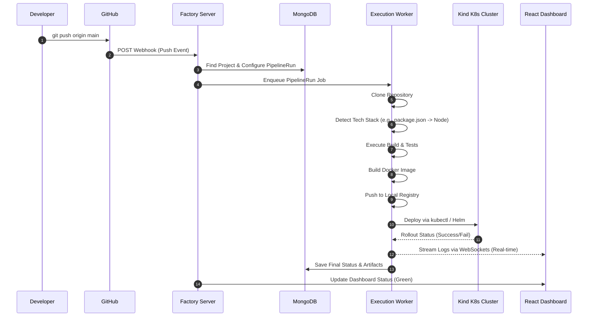
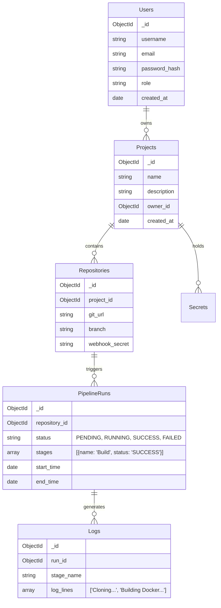

# Factory - The Ultimate CI/CD Platform 🏭

> **Factory** takes your raw code (source code) and automatically transforms it into a ready-to-sell, deployed product.

Factory is a self-hosted, highly scalable, and modular Continuous Integration & Continuous Deployment (CI/CD) platform designed from the ground up to replace enterprise solutions like Jenkins, GitHub Actions, GitLab CI, and Azure DevOps for your personalized environment.

## 📖 Table of Contents
1. [Platform Vision](#platform-vision)
2. [Technology Stack](#technology-stack)
3. [High-Level Architecture](#high-level-architecture)
4. [Workflow & Execution Flow](#workflow--execution-flow)
5. [Data Models (MongoDB)](#data-models-mongodb)
6. [Pipeline Engine & Extensibility](#pipeline-engine--extensibility)
7. [Frontend Architecture](#frontend-architecture)

---

## 🎯 Platform Vision
Factory aims to provide a zero-friction deployment experience. The developer simply pushes code from their Windows Development Machine to GitHub. Factory takes over from there on an isolated Ubuntu (WSL) Server, performing:
- **Repository Cloning & Type Detection** (Node.js, Python, etc.)
- **Dependency Installation & Testing**
- **Docker Image Building & Local Registry Pushing**
- **Kubernetes (Kind) Deployment & Live Health Checks**
- **Real-time Log Streaming** directly to a beautiful, modern dashboard.

---

## 💻 Technology Stack

### Frontend (The Dashboard)
- **Framework:** React.js (via Vite for lightning-fast builds)
- **Styling:** Tailwind CSS (utility-first, dark-mode optimized)
- **Component Library:** Material UI (MUI) for professional, robust, and accessible form controls, data grids, and modals.
- **Animations:** Framer Motion for premium micro-interactions, page transitions, and fluid dynamic UI.
- **Icons:** Lucide React / MUI Icons.
- **State Management & Data Fetching:** React Query / Zustand.

### Backend (The Core Engine)
- **Framework:** Python Flask (designed cleanly for future migration to FastAPI if needed).
- **Real-time Communication:** WebSockets (Flask-SocketIO) for streaming live build logs to the frontend.
- **Task Queue & Scheduler:** Python-based internal queues / Celery.

### Database
- **Primary Database:** MongoDB (NoSQL)
  - Ideal for flexible pipeline configurations, logs storage, and unstructured artifact metadata.

### Infrastructure & Execution
- **Containerization:** Docker Engine
- **Orchestration:** Kubernetes (using `Kind` for local clusters)
- **Git**

## 🏗️ Architecture

Factory mimics the core concepts of Jenkins, scaled for modern web environments:

1. **Master-Agent (Distributed System)**
   - **Factory Master (`app.py`)**: The Flask web server. It manages the queue, serves the React dashboard, and pushes real-time WebSocket updates to users.
   - **Factory Agent (`worker.py`)**: A standalone Python daemon that runs on any node. It polls the Master for jobs, clones code, runs subprocesses, and streams `stdout` back to the Master.

2. **Pipeline-as-Code (`factory.yml`)**
   - Similar to a `Jenkinsfile`, you can define custom stages inside your repositories.
   - The Agent dynamically parses `factory.yml` and executes the user-defined commands.

```mermaid
graph TD;
    User[Developer] -->|git push| GitHub(GitHub Webhook);
    GitHub -->|Triggers| Master[Factory Master Node];
    Master -->|Queues Job| Queue[(Job Queue)];
    
    subgraph Agent Node (Ubuntu/Linux)
      Worker[Factory Agent worker.py] -->|Polls| Queue;
      Worker -->|1. git clone| SourceCode;
      Worker -->|2. parses| FactoryYML(factory.yml);
      Worker -->|3. executes| Docker(Docker Daemon);
      Worker -->|Streams stdout| Master;
    end
    
    Master -->|WebSockets| UI[React Dashboard];
```

## 🚀 Getting Started

### 1. Master Server Setup
Run this on your main machine:
```bash
git clone https://github.com/manoj-chavan-13/Factory-.git
cd Factory-

# Backend Master
cd backend
python -m venv venv
source venv/bin/activate
pip install -r requirements.txt
python app.py

# Frontend Dashboard
cd ../frontend
npm install
npm run dev
```

### 2. Agent Node Setup
Run this on any machine where you want pipelines to execute:
```bash
cd backend
python worker.py
```        Engine --> Queue
        Queue --> Runner
        Runner --> LanguagePlugins
        Runner --> DockerPlugin
        Runner --> K8sPlugin
        
        Runner -->|Streams Live Logs| WebSocket[WebSocket Server]
        
        DB[(MongoDB)]
        Engine <-->|Read/Write| DB
        
        Registry[(Local Docker Registry)]
        DockerPlugin -->|Push Image| Registry
        
        K8s[Kind K8s Cluster]
        K8sPlugin -->|kubectl apply| K8s
    end
    
    subgraph "Frontend Dashboard"
        React[React + Tailwind + Material UI]
        React <-->|REST API| Engine
        WebSocket -->|Live Logs| React
    end
```

---

## 🔄 Workflow & Execution Flow

When a developer pushes code, the entire system orchestrates in an automated sequence:



---

## 🗄️ Data Models (MongoDB)

Because Factory uses MongoDB, the schema is highly flexible. Documents are stored in Collections.



---

## ⚙️ Pipeline Engine & Extensibility

The core pipeline engine does not contain hardcoded logic for specific languages. It acts as an orchestrator.

### The Plugin Architecture
Every language or deployment target is a plugin:
1. **Detector Phase:** Determines if the repo is Node.js (`package.json`), Python (`requirements.txt`), etc.
2. **Generator Phase:** Automatically constructs a pipeline schema if the repository lacks a custom `factory.yml` file.
3. **Execution Phase:** Uses isolated environments to run the commands safely.

**Future Support:** Easily extensible to support Java (Spring Boot), Go, Rust, .NET, React (Vite/Next.js build checks), and more.

---

## 🎨 Frontend Architecture

The user interface is designed to rival the best enterprise DevOps tools in the world.
- **Layout:** A clean sidebar navigation, top-level project breadcrumbs, and a detailed canvas for pipeline visualization.
- **Dashboard (Command Center):** Utilizes `@mui/x-data-grid` to display a professional list of all projects and their latest build statuses.
- **Pipeline Visualizer:** A stunning node-based graph. Nodes transition from gray to pulsing blue (`RUNNING`) to glowing green (`SUCCESS`).
- **Live Terminal (Pipeline Simulator):** A custom-built, WebSocket-connected terminal component that renders logs instantly.
- **Animations:** Framer Motion delivers smooth mounting of pages and satisfying transitions between pipeline stages.

## 🚀 Getting Started (Installation & Execution)

This section provides a complete guide to running the Factory CI/CD platform locally for development and testing.

### Prerequisites

Ensure you have the following installed on your machine:
- **Node.js** (v18+ recommended)
- **Python** (v3.10+ recommended)
- **MongoDB** (Running locally on port `27017` or via MongoDB Atlas)
- **Docker & Docker Compose**
- **Kind (Kubernetes in Docker)**

---

### 1. Backend Setup (Flask Engine)

The backend acts as the core orchestrator.

1. **Navigate to the backend directory:**
   ```bash
   cd backend
   ```
2. **Create a virtual environment:**
   ```bash
   python -m venv venv
   ```
3. **Activate the virtual environment:**
   - **Windows:** `venv\Scripts\activate`
   - **Mac/Linux:** `source venv/bin/activate`
4. **Install Python dependencies:**
   ```bash
   pip install -r requirements.txt
   ```
5. **Start the Flask server:**
   ```bash
   python app.py
   ```
   *The backend will now run on `http://localhost:5000`. It connects to MongoDB by default at `mongodb://localhost:27017/factory`.*

---

### 2. Frontend Setup (React Dashboard)

The frontend is a Vite-powered React application.

1. **Navigate to the frontend directory:**
   ```bash
   cd frontend
   ```
2. **Install Node dependencies:**
   ```bash
   npm install
   ```
3. **Initialize Tailwind CSS (if not already done):**
   ```bash
   npx tailwindcss init -p
   ```
4. **Start the Vite development server:**
   ```bash
   npm run dev
   ```
   *The frontend dashboard will now be accessible at `http://localhost:5173`.*

---

### 3. Running a Pipeline (Future Roadmap)

Once both servers are running:
1. Open the React Dashboard.
2. Create a new "Project" and link a GitHub Repository.
3. Push code to your repository.
4. Watch Factory automatically spawn a worker, build the Docker container, and stream the logs live!
